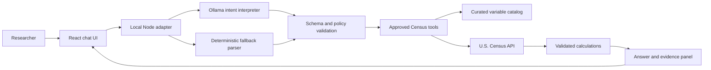

<p align="center">
  
</p>

<p align="center">
  <strong>Ask Census questions in plain English. Get answers you can defend.</strong>
</p>

<p align="center">
  A local-first research assistant that combines conversational AI with deterministic calculations and evidence from the official U.S. Census Bureau API.
</p>

---

## The challenge

Census data can answer high-value planning questions, but getting there often requires knowing the right dataset, variables, geography codes, and formulas. That creates friction for regional planners and other decision-makers who need trustworthy insights without becoming Census API experts.

CensusSense turns that workflow into a guided conversation:

1. Ask a county-level question in plain English.
2. Review the assistant's interpretation before any data is retrieved.
3. Confirm the analysis.
4. Receive ranked results, calculation details, caveats, and the exact Census API request.

## Why CensusSense

| Need | CensusSense response |
|---|---|
| Make Census data approachable | A chat-first interface accepts natural-language questions. |
| Prevent confident but unsupported answers | The model interprets intent; allowlisted application code selects variables and performs calculations. |
| Make results reviewable | Every answer preserves its dataset, vintage, variables, formula, raw values, warnings, and separate source requests by vintage. |
| Keep the demo resilient | A deterministic parser supports the core question set when Ollama is unavailable. |
| Protect credentials | The Census API key stays in the local server and is never sent to the browser. |

## What it can answer

The MVP supports allowlisted county- and state-level analyses across U.S. states and territories. The four county analyses below are the original judging scenarios, not hardcoded question branches:

| Analysis | Example question | Result |
|---|---|---|
| Population growth | "Which counties in Virginia have experienced the largest population growth?" | Compares two ACS vintages and ranks county growth. |
| Work-from-home change | "Where has the percentage of people working from home changed the most?" | Calculates and ranks percentage-point change. |
| Median household income | "Compare median household income across Fairfax, Loudoun, Henrico, Chesterfield, and Arlington counties." | Returns a named-county comparison. |
| Aging and income | "Which communities have both an aging population and relatively low household income?" | Applies documented age-share and income thresholds. |
| Poverty rate | "Which states have the highest poverty rates?" | Compares state-level poverty rates using the approved ACS variables. |

Requests outside the approved metric catalog or geography boundary receive an explicit clarification or unsupported response rather than a guessed answer. The catalog browser can search official ACS variable metadata, but discovered variables are review-only until their universe, geography, formula, and tests are added to the approved catalog. The model cannot select arbitrary Census variables or construct unrestricted API queries.

### Promoting a discovered variable

Catalog search results include a **Review and approve direct metric** action. The server re-checks the selected variable against official ACS metadata before registering it for the current server session. Approved direct metrics support raw numeric county or state comparisons and preserve the source variable in evidence. Derived metrics still require a reviewed formula and dedicated calculation tests.

Reviewed metrics are currently held in memory for the MVP and are cleared when the API restarts. Persisting approvals should be added only after the team agrees on an auditable review record and storage boundary.

## How it works



### AI interprets; code proves

The architecture separates probabilistic language understanding from authoritative data work.

**Ollama may:**

- Map a question to a supported intent.
- Identify the requested state, counties, years, and operation.
- Ask for clarification when a request is ambiguous.

**Deterministic application code always:**

- Resolves state and county FIPS codes.
- Selects allowlisted ACS 5-year variables.
- Builds the Census API request.
- Validates returned values.
- Calculates growth, percentages, rankings, and filters.
- Produces evidence and warnings.

The model cannot choose arbitrary Census variables, construct unrestricted queries, or author the official calculations.

## Demo flow

1. Select an example prompt or enter a supported question.
2. Inspect the proposed metric, years, geography, and operation.
3. Choose **Run analysis**.
4. Review the comparison table and any warnings.
5. Expand **View evidence** to inspect the dataset, vintage, geography, variables, calculation, filters, raw values, warnings, and one source request per ACS vintage.

## Getting started

### Prerequisites

- Node.js and npm
- A [U.S. Census API key](https://api.census.gov/data/key_signup.html)
- Optional: [Ollama](https://ollama.com/) with `mistral-nemo:latest` or another model selected through `OLLAMA_MODEL`

### Install and configure

```powershell
git clone https://github.com/bc-bah/censense.git
Set-Location censense
npm install
Copy-Item .env.example .env
```

Update `.env` with your Census API key:

```dotenv
PORT=3001
CENSUS_API_KEY=your-census-api-key
OLLAMA_URL=http://localhost:11434
```

To use a different local model, add `OLLAMA_MODEL` to `.env`. If Ollama is unavailable, CensusSense falls back to deterministic interpretation for the metrics it can recognize without model assistance.

### Run locally

```powershell
npm run dev
```

Open [http://localhost:5173](http://localhost:5173). The Vite client proxies API calls to the local server on port `3001`.

### Build and test

```powershell
npm run build
npm test
```

`npm run build` compiles the TypeScript server and creates the Vite production bundle. `npm test` runs the deterministic calculation, interpretation, and Census-response validation tests.

## Technology

| Layer | Technology |
|---|---|
| User experience | React 19, TypeScript, Vite |
| Local adapter | Node.js, Express |
| Language interpretation | Ollama with JSON-constrained output |
| Validation | Zod and typed application contracts |
| Authoritative data | U.S. Census Bureau ACS 5-year API |
| Verification | Vitest |

## Repository guide

```text
.
|-- assets/                  # CensusSense brand assets
|-- docs/
|   |-- high-level-architecture.md
|   |-- detailed-specification.md
|   `-- teammate-brief.md
|-- src/
|   |-- census/              # Catalog, API client, validation, and calculations
|   |-- client/              # Chat interface and evidence presentation
|   |-- interpretation/      # Ollama-independent fallback parser
|   |-- server/              # Express API and Ollama adapter
|   |-- shared/              # Typed contracts
|   `-- test/                # Deterministic unit tests
|-- .env.example
|-- package.json
`-- README.md
```

For design rationale and the full request lifecycle, see the [high-level architecture](docs/high-level-architecture.md). For API contracts and supported intent details, see the [detailed development specification](docs/detailed-specification.md).

## Current scope

CensusSense is a focused hackathon MVP. It currently supports county-level questions in the approved metric catalog, keeps conversation state in memory, and relies on the live Census API for results. It does not attempt unrestricted Census question answering, arbitrary variable discovery, authentication, or persistent conversation storage.

## Responsible design

- Ambiguous inputs trigger clarification instead of assumptions.
- Unsupported metrics are rejected explicitly.
- Census API failures surface as errors; they never become generated answers.
- Incompatible datasets, units, universes, or vintages are blocked from comparison.
- Missing or suppressed values are preserved as warnings.
- Secrets remain server-side and `.env` must never be committed.

## Collaborators

- Ricardo Pizarro
- Behnido Calida
- Sarah Nolt-Caraway
