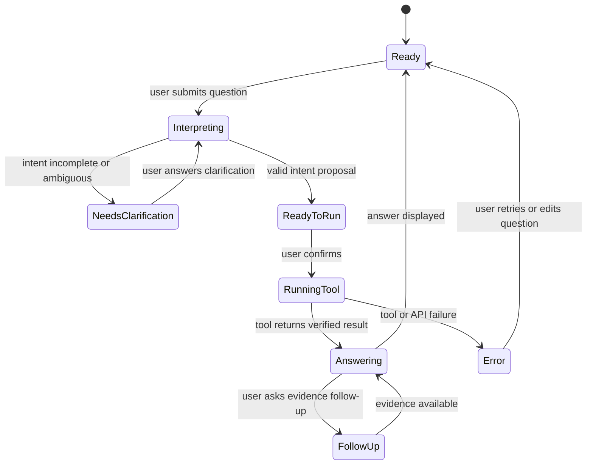

# CensusSense Detailed Development Specification

**Status:** Implemented (MVP plus poverty-rate and health-outcome extensions); sections below marked "Current status" note remaining gaps between this spec and the code.  
**Basis:** [High-Level Architecture](high-level-architecture.md)  
**Audience:** Development team  
**Last updated:** 2026-09-11

## 1. Product Contract

CensusSense accepts a plain-English Census question and returns a conversational, evidence-backed answer. The system must be useful when Ollama is available and still support the four original judging questions through a deterministic fallback parser when it is not. The approved metric catalog has since grown beyond those four to include a state-level poverty comparison and a combined Census/CDC health-outcome metric (see below).

### Supported metrics

| Key | User intent | Required operation |
|---|---|---|
| `population` | Rank counties by population growth, or compare totals | Compare two population vintages and rank growth, or compare one vintage |
| `work_from_home` | Find where work-from-home percentage changed most | Compare two percentages across the same geographies |
| `median_household_income` | Compare income across named counties | Retrieve one income metric for each named county |
| `aging_and_income` | Find communities with aging populations and low income | Retrieve two ACS metrics and apply documented thresholds |
| `poverty_rate` | Compare poverty rate across named states | State-level comparison using ACS poverty variables |
| `low_income_high_disease_prevalence` | Find counties with low income and high diabetes prevalence | Join an ACS income variable with a CDC PLACES diabetes-prevalence measure by county FIPS and apply documented thresholds |

Only `population` and `poverty_rate` support the `growth`/`change`/state comparison shown above; every metric ultimately resolves through `getMetricDefinition()`, which also recognizes metrics registered at runtime via the catalog-review endpoint (see Section 4). Anything outside the resolvable catalog must receive an explicit unsupported response.

### Visualization contract

Completed answers may include visualization metadata and an optional distribution profile. The client applies this priority order:

1. Two continuous spatial variables use a 3x3 bivariate comparison.
2. Spatial comparisons where land area would distort the insight use equal-area hex tiles.
3. A ridgeline is selected only when the answer includes real bins or samples.
4. All other answers use a faceted estimate dot plot, with 90% whiskers only when uncertainty is supplied.

The server supplies metadata for the approved metrics; the browser does not infer multivariate semantics from arbitrary value keys. A single point estimate never qualifies as a distribution. Distribution profiles may come from approved ACS detailed-table bins, in which case the visual must identify the result as an approximate binned reconstruction, or from geography-level observations when the question explicitly asks about the spread of geography estimates. Those observations must not be described as individual-level demographic distributions.

ACS margin-of-error retrieval is not yet enabled in the Census client. The shared contract supports margin of error and standard error fields, and the renderer remains estimate-only when they are absent. Derived metric uncertainty must be propagated from paired estimate/MOE variables in a future data-client change rather than copied from a raw source variable.

## 2. Runtime and Repository Shape

Actual structure:

```text
package.json
tsconfig.json
tsconfig.server.json
vite.config.ts

src/
  client/
    App.tsx
    CatalogNetwork.tsx
    ResultChart.tsx
    StoryMap.tsx
    main.tsx
    transcript.ts
    *.css
  server/
    index.ts
    intentValidation.ts
    ollamaClient.ts
  census/
    catalog.ts
    reviewedCatalog.ts
    client.ts
    placesClient.ts
    geographies.ts
    states.ts
    metadata.ts
    calculations.ts
    responseValidation.ts
    placesResponseValidation.ts
  interpretation/
    fallbackParser.ts
  shared/
    contracts.ts
  test/
    calculations.test.ts
    fallbackParser.test.ts
    intentValidation.test.ts
    responseValidation.test.ts
    placesResponseValidation.test.ts
```

The browser uses the server adapter through HTTP. The server adapter calls Ollama, the Census API, and the CDC PLACES API. Do not put an Ollama API key, unrestricted Census query builder, or authoritative calculation in the browser. `src/census/geographies.ts` predates the current state-driven geography resolution in `states.ts` and is unused dead code kept only for historical reference; `resolveStateFips()`/`resolveStateFipsList()` in `states.ts` are the active geography resolvers for any U.S. state or territory.

## 3. Conversation State

```ts
type Conversation = {
  id: string;
  messages: Message[];
  pendingIntent?: QuestionIntent;
  activeAnswer?: CensusAnswer;
  createdAt: string;
  updatedAt: string;
};

type Message = {
  id: string;
  role: "user" | "assistant" | "tool";
  kind: "question" | "interpretation" | "clarification" | "activity" | "answer" | "error";
  text: string;
  toolName?: string;
  evidence?: Evidence;
  createdAt: string;
};
```

Conversation state is in-memory for the MVP. A refresh may lose the conversation; persistence is out of scope unless the demo requires it.

### Conversation states



## 4. HTTP API

### `POST /api/conversations`

Creates a conversation.

Response:

```json
{
  "conversationId": "conversation-uuid"
}
```

### `POST /api/conversations/:id/messages`

Request:

```json
{
  "text": "Which counties in Virginia have experienced the largest population growth?"
}
```

Response for an interpretation:

```json
{
  "message": {
    "role": "assistant",
    "kind": "interpretation",
    "text": "I will compare population growth across Virginia counties between the configured Census years.",
    "intent": {
      "metric": "population",
      "geography": "county",
      "state": "Virginia",
      "years": ["2021", "2023"],
      "operation": "growth"
    },
    "requiresConfirmation": true
  }
}
```

Response for a clarification:

```json
{
  "message": {
    "role": "assistant",
    "kind": "clarification",
    "text": "Which years should I compare for population growth?"
  }
}
```

Response for a completed answer:

```json
{
  "message": {
    "role": "assistant",
    "kind": "answer",
    "text": "Henrico County had the largest population growth among the compared Virginia counties.",
    "answer": {
      "summary": "Henrico County had the largest population growth among the compared Virginia counties.",
      "rows": [],
      "evidence": {},
      "warnings": []
    }
  }
}
```

### `POST /api/conversations/:id/confirm`

Request:

```json
{
  "intent": {
    "metric": "median_household_income",
    "geography": "county",
    "state": "Virginia",
    "counties": ["Fairfax County", "Loudoun County"],
    "years": ["2023"],
    "operation": "compare"
  }
}
```

The server must validate this intent again. The client confirmation is not trusted.

### `GET /api/catalog/search`

Searches official ACS variable metadata by keyword (`q`, minimum two characters) and vintage (`year`, default `2023`). Returns matching variables with `reviewRequired: true` — search results are discovery-only and are never used to build a request until approved.

### `POST /api/catalog/approve`

Request: `{ id, key, label, geography, unit, year }` — an ACS variable ID, a new lowercase-with-underscores metric key, a display label, `county` or `state` geography, a unit, and a four-digit vintage. The server re-validates the variable against Census metadata (must be a numeric `int`/`float` predicate type), then calls `registerReviewedMetric()` to add it to the in-memory reviewed-metric registry for the running server process. Reviewed metrics support only direct numeric comparisons (no derived formulas) and are cleared on restart; they are a separate mechanism from the first-class metrics defined in `metricCatalog` (Section 8).

### `GET /api/ollama/models`

Calls Ollama's native `GET /api/tags` to list locally pulled models. Returns `{ activeModel, models }`; if Ollama is unreachable, returns `{ activeModel, models: [], error }` with a `502` status so the client can show a fallback-only state instead of retrying indefinitely.

### `POST /api/ollama/model`

Request: `{ model }`. Sets the in-memory active model used by every subsequent `generateIntent()` call for the running server process — no restart required. Returns `{ activeModel }`. This does not persist across a server restart (falls back to `OLLAMA_MODEL`/`mistral-nemo:latest`) and does not affect the deterministic fallback parser or any Census/CDC calculation logic.

### `GET /api/health`

Returns `{ ok, fallback, ollama, model, supportedMetrics }`, where `model` reflects the live active model (`ollama.getModel()`), not a static environment value.

## 5. Shared Intent Contract

```ts
type Metric =
  | "population"
  | "work_from_home"
  | "median_household_income"
  | "aging_and_income"
  | "poverty_rate"
  | "low_income_high_disease_prevalence"
  | (string & {}); // also accepts runtime-registered reviewed-metric keys

type Operation = "compare" | "growth" | "change" | "filter";
type InterpretationSource = "ollama" | "fallback";

type QuestionIntent = {
  metric: Metric;
  geography: "county" | "state";
  state?: string;
  states?: string[];
  counties?: string[];
  limit?: number;
  years: string[];
  operation: Operation;
  comparison?: {
    baselineYear?: string;
    laterYear?: string;
  };
  filters?: {
    agingThreshold?: number;
    incomeThreshold?: number;
    diseasePrevalenceThreshold?: number;
  };
  interpretationSource?: InterpretationSource;
};
```

### Intent validation rules (`validateIntent()` in `src/server/index.ts`)

- `metric` must resolve via `getMetricDefinition()` (first-class catalog entry or a runtime-reviewed metric).
- `geography` must be `county` or `state`.
- A `state` geography requires at least two named `states` that resolve through `resolveStateFipsList()`.
- A `county` geography requires a single `state` that resolves through `resolveStateFips()`.
- `years` must be four-digit strings.
- A `growth` or `change` operation requires at least two years.
- A `median_household_income` compare operation requires at least one named county or a `limit`.
- Thresholds for `aging_and_income` and `low_income_high_disease_prevalence` fall back to documented defaults (20% / $60,000, and $60,000 / 12%, respectively) when omitted from the intent; the defaults are always disclosed to the user in the interpretation text and evidence filters.

## 6. Ollama Adapter

The adapter exposes one model-independent interface, plus runtime model management:

```ts
type OllamaClient = {
  generateIntent(input: {
    question: string;
    messages: Message[];
    supportedMetrics: string[];
  }): Promise<QuestionIntent | null>;
  explainVerifiedAnswer(input: {
    question: string;
    answer: CensusAnswer;
    followUp?: string;
  }): Promise<string>;
  getModel(): string;
  setModel(model: string): void;
  listModels(): Promise<string[]>;
};
```

The adapter must configure the model for low-temperature, structured output where supported. The model output is untrusted text until parsed and validated. The system prompt must state that the model may only use the supplied metric catalog and may not invent data. `getModel()`/`setModel()` hold a mutable in-memory active model (seeded from `OLLAMA_MODEL`, default `mistral-nemo:latest`); `generateIntent()` always reads the current value, so switching models takes effect on the next question with no server restart. `listModels()` calls Ollama's `GET /api/tags` to enumerate locally pulled models for the UI's model picker (Section 10) and the `GET /api/ollama/models` endpoint (Section 4).

### Model selection

Benchmark the locally available chat models:

- `gpt-oss:20b`
- `gemma4:31b`
- `mistral-nemo:latest`

Record for each model:

- Valid intent rate across the four judging questions
- Clarification quality for incomplete questions
- Tool-schema compliance
- Grounding quality of explanations
- Median response latency on the demo machine

The default model is a configuration value, not hard-coded into UI logic. `nomic-embed-text-v2-moe:latest` is reserved for a future retrieval need and is not part of the MVP request path. The active model can also be changed at runtime from the chat UI's model picker or by calling `POST /api/ollama/model`, which is useful for running this benchmark interactively without editing `.env` or restarting the server.

## 7. Deterministic Tool Contracts

The conceptual tool boundary below still holds, but the implementation consolidates these steps inside `runCensusIntent()` in `src/census/client.ts` (plus `queryPlacesCounty()` in `src/census/placesClient.ts` for the CDC PLACES metric) rather than as four separate named tools. The model never calls these directly — it only proposes a `QuestionIntent`, which the server validates and then dispatches.

### `resolve_geographies`

Input:

```ts
type ResolveGeographiesInput = {
  state?: string;
  counties: string[];
};
```

Output:

```ts
type Geography = {
  name: string;
  stateFips: string;
  countyFips: string;
};
```

Unknown or ambiguous names are errors, not fuzzy guesses.

### `query_census`

Input uses catalog keys only:

```ts
type CensusQueryInput = {
  datasetKey: string;
  vintage: string;
  metricKeys: string[];
  geographies: Geography[];
};
```

The server maps `datasetKey` and `metricKeys` to approved Census endpoints and variables. The model cannot supply arbitrary variable IDs or URLs.

### `calculate_comparison`

Input:

```ts
type CalculationInput = {
  operation: "compare" | "growth" | "change" | "filter";
  metricKey: string;
  values: RawCensusValue[];
  baselineYear?: string;
  laterYear?: string;
  thresholds?: Record<string, number>;
};
```

Output contains numeric results, formula text, invalid-row handling, and warnings. The model never receives responsibility for this operation.

### `build_evidence`

Builds the evidence object from validated request and calculation data. It must not accept prose as a source of truth.

## 8. Census Catalog

The implemented catalog (`metricCatalog` in `src/census/catalog.ts`) uses a simpler shape than originally proposed:

```ts
type MetricDefinition = {
  label: string;
  dataset: string; // e.g. "ACS 5-year estimates" or "ACS 5-year estimates + CDC PLACES"
  variables: Array<{ id: string; label: string; unit: string }>;
};
```

For Census-only metrics, `variables[].id` is an ACS table ID (e.g. `B19013_001E`). For `low_income_high_disease_prevalence`, the catalog lists both the ACS income variable and a CDC PLACES `measureid` (`DIABETES`) side by side — the calculation branch in `runCensusIntent()` queries each source separately and joins the results by county FIPS. `getMetricDefinition()` in `src/census/reviewedCatalog.ts` also folds in any metric registered at runtime via `POST /api/catalog/approve` (see Section 4), using the separate `ReviewedMetricDefinition` shape documented there. The catalog is the only source used to construct Census and PLACES requests; the model cannot select arbitrary variables.

## 9. Answer and Evidence Contract

```ts
type CensusAnswer = {
  summary: string;
  rows: Array<{
    geography: string;
    geographyId?: { stateFips: string; countyFips?: string };
    values: Record<string, number | null>;
    rank?: number;
  }>;
  evidence: Evidence;
  warnings: string[];
};

type EvidenceRequest = { vintage: string; url: string };

type Evidence = {
  dataset: string;
  vintage: string;
  variables: Array<{
    id: string;
    label: string;
    universe?: string;
    unit?: string;
  }>;
  geography: string;
  filters: Record<string, string>;
  requests: EvidenceRequest[];
  rawValues: Array<Record<string, unknown>>;
  calculation: string;
  retrievedAt: string;
};
```

`requests` holds one entry per API call needed to produce the answer \u2014 for example, one Census request per ACS vintage for a growth comparison, or one Census request plus one CDC PLACES request for `low_income_high_disease_prevalence`. Each entry's `url` is the public request URL with any API key or app token stripped before it is stored.

The UI must make all evidence fields inspectable without requiring Grace to read raw JSON. Every request URL must be clickable, and the table must agree with the summary.

## 10. UI Requirements

The primary screen contains:

- Conversation transcript
- Composer with submit and cancel behavior
- Example question prompts, including the four original judging questions plus the poverty-rate and income/diabetes-prevalence extensions
- Interpretation or clarification message
- Human-readable tool activity
- Answer summary
- Results table for multiple geographies
- Warnings and uncertainty indicators
- Keyboard-accessible "View evidence" control
- Evidence panel with dataset, vintage, variables, geography, formula, raw values, and one request URL per API call
- Model picker in the top bar showing the active Ollama model and letting the user switch to any other locally pulled model (via `GET`/`POST /api/ollama/model(s)`); shows a fallback-only indicator when Ollama is unreachable

Required states:

- Empty
- Interpreting
- Needs clarification
- Ready for confirmation
- Querying Census
- Calculating
- Success
- Partial result
- Unsupported question
- Ollama unavailable with fallback active
- Census API failure
- Invalid or missing values

Color must not be the only status signal. Dynamic messages need accessible text and visible focus states.

## 11. Error Contract

```ts
type AppError = {
  code:
    | "INVALID_INTENT"
    | "AMBIGUOUS_QUESTION"
    | "UNSUPPORTED_METRIC"
    | "GEOGRAPHY_NOT_FOUND"
    | "CENSUS_API_FAILURE"
    | "CENSUS_RESPONSE_INVALID"
    | "MISSING_VALUE"
    | "OLLAMA_UNAVAILABLE";
  message: string;
  retryable: boolean;
  details?: Record<string, unknown>;
};
```

Errors shown to Grace should explain the next action. Internal stack traces and raw prompts must not be displayed.

## 12. Testing Specification

**Current status:** the implemented test suite (`src/test/*.test.ts`) covers unit-level parsing, calculation, and response-validation behavior with inline fixtures rather than a separate `fixtures/` directory or a dedicated judging-question test file; each judging question and the newer metrics are covered as individual `it()` cases inside `fallbackParser.test.ts` and `calculations.test.ts`. The goals below remain the target for coverage depth.

### Unit tests

- Validate every intent rule.
- Resolve known Virginia counties to expected FIPS codes.
- Reject unknown and ambiguous geography names.
- Construct expected Census URLs from catalog keys.
- Parse valid, malformed, missing, and suppressed Census rows.
- Calculate population growth with zero and missing baselines handled explicitly.
- Calculate work-from-home percentage changes using compatible denominators.
- Rank only valid numeric rows.
- Preserve margin-of-error values and warnings.
- Build evidence with the exact request URL and formula.

### Contract tests

- Ollama output that matches the schema is accepted.
- Ollama output with unknown metrics, variables, URLs, formulas, or fields is rejected.
- Tool inputs cannot bypass the catalog.
- The explanation layer cannot alter numeric answer fields.

### Judging-question tests

Each judging question gets a deterministic fixture and verifies:

1. Original question.
2. Parsed intent.
3. Tool inputs.
4. Census response fixture.
5. Calculation output.
6. Summary text inputs.
7. Evidence fields.
8. Warning behavior.

Tests must not require live Census or Ollama availability.

## 13. Parallel Implementation Plan

### Data engineer

Implement `src/census/`, catalog verification, fixtures, and calculation tests. Deliver typed tool functions before UI integration.

### AI/application engineer

Implement `src/server/`, Ollama adapter, conversation state, schemas, orchestration, fallback parser, and model benchmark script.

### UX/frontend engineer

Implement `src/client/`, chat states, tool activity, answer display, evidence panel, responsive layout, and accessibility behavior against mocked API responses.

### Verification/integration engineer

Implement cross-layer contract tests, judging-question fixtures, error-path tests, manual demo script, and integration fixes. Do not wait until the end to test the four flows.

### Shared integration rule

All workstreams must consume `src/shared/contracts.ts`. Changes to intent, answer, evidence, or error types require review by all four owners.

## 14. Delivery Sequence

1. Verify Census variables, datasets, vintages, and FIPS fixtures.
2. Freeze shared contracts and error codes.
3. Implement chat shell with mocked conversation responses.
4. Implement Ollama adapter and deterministic fallback parser.
5. Implement the five-county median-income flow end to end.
6. Add evidence inspection and source URL handling.
7. Add population growth, work-from-home change, and aging/income filters.
8. Benchmark local models and select the default.
9. Run the full judging rehearsal, including failure and follow-up flows.

## 15. Definition of Done

- Grace can ask each judging question in the chat UI.
- The assistant shows an interpretation or asks a clarification before execution.
- All Census variables and geographies come from approved catalogs.
- All calculations are deterministic and tested.
- Every answer includes inspectable evidence and a source URL.
- Ollama unavailability produces a clear fallback or error.
- Census failures never produce fabricated answers.
- The team can explain model selection, AI use, and guardrails during judging.