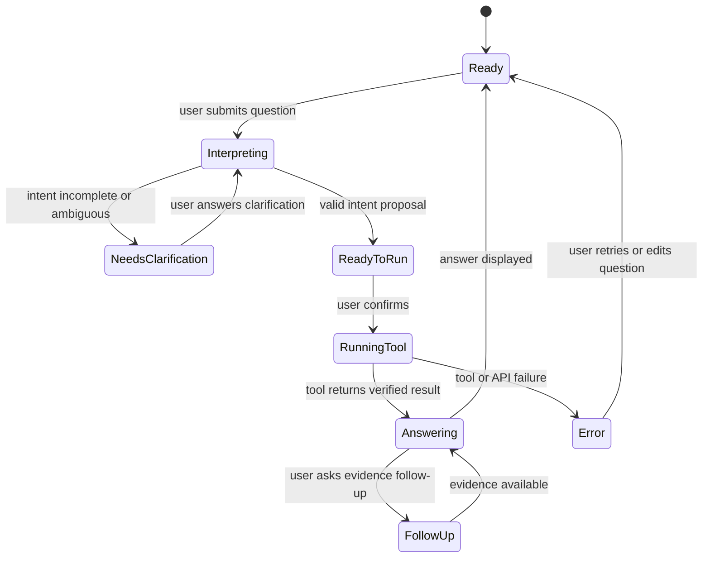

# CensusSense Detailed Development Specification

**Status:** Proposed  
**Basis:** [High-Level Architecture](high-level-architecture.md)  
**Audience:** Development team  
**Last updated:** 2026-09-11

## 1. Product Contract

CensusSense accepts a plain-English Census question and returns a conversational, evidence-backed answer. The system must be useful when Ollama is available and still support the four judging questions through a deterministic fallback parser when it is not.

### Supported judging questions

| Key | User intent | Required operation |
|---|---|---|
| `population_growth` | Rank Virginia counties by population growth | Compare two population vintages and rank growth |
| `work_from_home_change` | Find where work-from-home percentage changed most | Compare two percentages across the same geographies |
| `median_household_income` | Compare income across named counties | Retrieve one income metric for each named county |
| `aging_and_income` | Find communities with aging populations and low income | Retrieve two metrics and apply documented filters |

Anything outside the supported catalog must receive an explicit unsupported response.

## 2. Runtime and Repository Shape

Recommended initial structure:

```text
package.json
tsconfig.json
vite.config.ts

src/
  client/
    api.ts
    App.tsx
    styles.css
    components/
      ChatTranscript.tsx
      ChatComposer.tsx
      InterpretationMessage.tsx
      ToolActivity.tsx
      AnswerMessage.tsx
      ResultsTable.tsx
      EvidencePanel.tsx
      StatusMessage.tsx
  server/
    index.ts
    conversationStore.ts
    ollamaClient.ts
    orchestrator.ts
    schemas.ts
    tools.ts
  census/
    catalog.ts
    client.ts
    geographies.ts
    calculations.ts
    responseValidation.ts
  interpretation/
    fallbackParser.ts
    prompts.ts
  shared/
    contracts.ts
    errors.ts
  test/
    fixtures/
    calculations.test.ts
    censusClient.test.ts
    fallbackParser.test.ts
    judgingQuestions.test.ts
    schemas.test.ts
```

The browser uses the server adapter through HTTP. The server adapter calls Ollama and the Census API. Do not put an Ollama API key, unrestricted Census query builder, or authoritative calculation in the browser.

## 3. Conversation State

```ts
type Conversation = {
  id: string;
  messages: Message[];
  pendingIntent?: QuestionIntent;
  activeAnswer?: CensusAnswer;
  createdAt: string;
  updatedAt: string;
};

type Message = {
  id: string;
  role: "user" | "assistant" | "tool";
  kind: "question" | "interpretation" | "clarification" | "activity" | "answer" | "error";
  text: string;
  toolName?: string;
  evidence?: Evidence;
  createdAt: string;
};
```

Conversation state is in-memory for the MVP. A refresh may lose the conversation; persistence is out of scope unless the demo requires it.

### Conversation states



## 4. HTTP API

### `POST /api/conversations`

Creates a conversation.

Response:

```json
{
  "conversationId": "conversation-uuid"
}
```

### `POST /api/conversations/:id/messages`

Request:

```json
{
  "text": "Which counties in Virginia have experienced the largest population growth?"
}
```

Response for an interpretation:

```json
{
  "message": {
    "role": "assistant",
    "kind": "interpretation",
    "text": "I will compare population growth across Virginia counties between the configured Census years.",
    "intent": {
      "metric": "population",
      "geography": "county",
      "state": "Virginia",
      "years": ["2021", "2023"],
      "operation": "growth"
    },
    "requiresConfirmation": true
  }
}
```

Response for a clarification:

```json
{
  "message": {
    "role": "assistant",
    "kind": "clarification",
    "text": "Which years should I compare for population growth?"
  }
}
```

Response for a completed answer:

```json
{
  "message": {
    "role": "assistant",
    "kind": "answer",
    "text": "Henrico County had the largest population growth among the compared Virginia counties.",
    "answer": {
      "summary": "Henrico County had the largest population growth among the compared Virginia counties.",
      "rows": [],
      "evidence": {},
      "warnings": []
    }
  }
}
```

### `POST /api/conversations/:id/confirm`

Request:

```json
{
  "intent": {
    "metric": "median_household_income",
    "geography": "county",
    "state": "Virginia",
    "counties": ["Fairfax County", "Loudoun County"],
    "years": ["2023"],
    "operation": "compare"
  }
}
```

The server must validate this intent again. The client confirmation is not trusted.

## 5. Shared Intent Contract

```ts
type Metric =
  | "population"
  | "work_from_home"
  | "median_household_income"
  | "aging_and_income";

type Operation = "compare" | "growth" | "change" | "filter";

type QuestionIntent = {
  metric: Metric;
  geography: "county";
  state?: string;
  counties?: string[];
  years: string[];
  operation: Operation;
  comparison?: {
    baselineYear?: string;
    laterYear?: string;
  };
  filters?: {
    agingThreshold?: number;
    incomeThreshold?: number;
  };
};
```

### Intent validation rules

- `metric` must be in the metric catalog.
- `geography` must be `county` for the MVP.
- `years` must contain the number of years required by the metric.
- A growth or change operation requires distinct baseline and later years.
- Named county comparisons require at least two counties.
- State and county names must resolve through the geography catalog.
- Thresholds for `aging_and_income` must be explicit in the intent or supplied by configured defaults shown to the user.
- Unknown fields must be rejected or stripped before tool dispatch.

## 6. Ollama Adapter

The adapter should expose one model-independent interface:

```ts
type OllamaClient = {
  generateIntent(input: {
    question: string;
    messages: Message[];
    supportedMetrics: string[];
  }): Promise<ModelIntentResult>;
  explainVerifiedAnswer(input: {
    question: string;
    answer: CensusAnswer;
    followUp?: string;
  }): Promise<string>;
};
```

The adapter must configure the model for low-temperature, structured output where supported. The model output is untrusted text until parsed and validated. The system prompt must state that the model may only use the supplied metric catalog and may not invent data.

### Model selection

Benchmark the locally available chat models:

- `gpt-oss:20b`
- `gemma4:31b`
- `mistral-nemo:latest`

Record for each model:

- Valid intent rate across the four judging questions
- Clarification quality for incomplete questions
- Tool-schema compliance
- Grounding quality of explanations
- Median response latency on the demo machine

The default model is a configuration value, not hard-coded into UI logic. `nomic-embed-text-v2-moe:latest` is reserved for a future retrieval need and is not part of the MVP request path.

## 7. Deterministic Tool Contracts

### `resolve_geographies`

Input:

```ts
type ResolveGeographiesInput = {
  state?: string;
  counties: string[];
};
```

Output:

```ts
type Geography = {
  name: string;
  stateFips: string;
  countyFips: string;
};
```

Unknown or ambiguous names are errors, not fuzzy guesses.

### `query_census`

Input uses catalog keys only:

```ts
type CensusQueryInput = {
  datasetKey: string;
  vintage: string;
  metricKeys: string[];
  geographies: Geography[];
};
```

The server maps `datasetKey` and `metricKeys` to approved Census endpoints and variables. The model cannot supply arbitrary variable IDs or URLs.

### `calculate_comparison`

Input:

```ts
type CalculationInput = {
  operation: "compare" | "growth" | "change" | "filter";
  metricKey: string;
  values: RawCensusValue[];
  baselineYear?: string;
  laterYear?: string;
  thresholds?: Record<string, number>;
};
```

Output contains numeric results, formula text, invalid-row handling, and warnings. The model never receives responsibility for this operation.

### `build_evidence`

Builds the evidence object from validated request and calculation data. It must not accept prose as a source of truth.

## 8. Census Catalog

Every catalog entry must define:

```ts
type MetricDefinition = {
  key: string;
  label: string;
  datasetKey: string;
  allowedGeography: "county";
  variableIds: string[];
  universe: string;
  unit: string;
  calculation?: string;
  caveats: string[];
};
```

The catalog is the only source used to construct Census requests. Before implementation, the data-layer owner must verify each variable ID and label against Census metadata and record the chosen ACS product and vintage.

## 9. Answer and Evidence Contract

```ts
type CensusAnswer = {
  summary: string;
  rows: Array<{
    geography: string;
    values: Record<string, number | null>;
    marginOfError?: Record<string, number | null>;
    rank?: number;
  }>;
  evidence: Evidence;
  warnings: string[];
};

type Evidence = {
  dataset: string;
  vintage: string;
  variables: Array<{
    id: string;
    label: string;
    universe?: string;
    unit?: string;
  }>;
  geography: string;
  filters: Record<string, string>;
  requestUrl: string;
  rawValues: Array<Record<string, unknown>>;
  calculation: string;
  retrievedAt: string;
};
```

The UI must make all evidence fields inspectable without requiring Grace to read raw JSON. The raw source URL must be clickable, and the table must agree with the summary.

## 10. UI Requirements

The primary screen contains:

- Conversation transcript
- Composer with submit and cancel behavior
- Example question prompts for the four judging questions
- Interpretation or clarification message
- Human-readable tool activity
- Answer summary
- Results table for multiple geographies
- Warnings and uncertainty indicators
- Keyboard-accessible “View evidence” control
- Evidence panel with dataset, vintage, variables, geography, formula, raw values, and URL

Required states:

- Empty
- Interpreting
- Needs clarification
- Ready for confirmation
- Querying Census
- Calculating
- Success
- Partial result
- Unsupported question
- Ollama unavailable with fallback active
- Census API failure
- Invalid or missing values

Color must not be the only status signal. Dynamic messages need accessible text and visible focus states.

## 11. Error Contract

```ts
type AppError = {
  code:
    | "INVALID_INTENT"
    | "AMBIGUOUS_QUESTION"
    | "UNSUPPORTED_METRIC"
    | "GEOGRAPHY_NOT_FOUND"
    | "CENSUS_API_FAILURE"
    | "CENSUS_RESPONSE_INVALID"
    | "MISSING_VALUE"
    | "OLLAMA_UNAVAILABLE";
  message: string;
  retryable: boolean;
  details?: Record<string, unknown>;
};
```

Errors shown to Grace should explain the next action. Internal stack traces and raw prompts must not be displayed.

## 12. Testing Specification

### Unit tests

- Validate every intent rule.
- Resolve known Virginia counties to expected FIPS codes.
- Reject unknown and ambiguous geography names.
- Construct expected Census URLs from catalog keys.
- Parse valid, malformed, missing, and suppressed Census rows.
- Calculate population growth with zero and missing baselines handled explicitly.
- Calculate work-from-home percentage changes using compatible denominators.
- Rank only valid numeric rows.
- Preserve margin-of-error values and warnings.
- Build evidence with the exact request URL and formula.

### Contract tests

- Ollama output that matches the schema is accepted.
- Ollama output with unknown metrics, variables, URLs, formulas, or fields is rejected.
- Tool inputs cannot bypass the catalog.
- The explanation layer cannot alter numeric answer fields.

### Judging-question tests

Each judging question gets a deterministic fixture and verifies:

1. Original question.
2. Parsed intent.
3. Tool inputs.
4. Census response fixture.
5. Calculation output.
6. Summary text inputs.
7. Evidence fields.
8. Warning behavior.

Tests must not require live Census or Ollama availability.

## 13. Parallel Implementation Plan

### Data engineer

Implement `src/census/`, catalog verification, fixtures, and calculation tests. Deliver typed tool functions before UI integration.

### AI/application engineer

Implement `src/server/`, Ollama adapter, conversation state, schemas, orchestration, fallback parser, and model benchmark script.

### UX/frontend engineer

Implement `src/client/`, chat states, tool activity, answer display, evidence panel, responsive layout, and accessibility behavior against mocked API responses.

### Verification/integration engineer

Implement cross-layer contract tests, judging-question fixtures, error-path tests, manual demo script, and integration fixes. Do not wait until the end to test the four flows.

### Shared integration rule

All workstreams must consume `src/shared/contracts.ts`. Changes to intent, answer, evidence, or error types require review by all four owners.

## 14. Delivery Sequence

1. Verify Census variables, datasets, vintages, and FIPS fixtures.
2. Freeze shared contracts and error codes.
3. Implement chat shell with mocked conversation responses.
4. Implement Ollama adapter and deterministic fallback parser.
5. Implement the five-county median-income flow end to end.
6. Add evidence inspection and source URL handling.
7. Add population growth, work-from-home change, and aging/income filters.
8. Benchmark local models and select the default.
9. Run the full judging rehearsal, including failure and follow-up flows.

## 15. Definition of Done

- Grace can ask each judging question in the chat UI.
- The assistant shows an interpretation or asks a clarification before execution.
- All Census variables and geographies come from approved catalogs.
- All calculations are deterministic and tested.
- Every answer includes inspectable evidence and a source URL.
- Ollama unavailability produces a clear fallback or error.
- Census failures never produce fabricated answers.
- The team can explain model selection, AI use, and guardrails during judging.