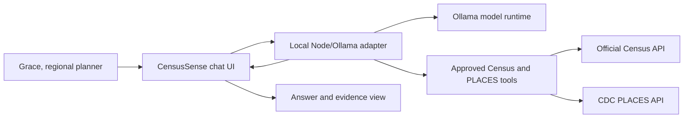
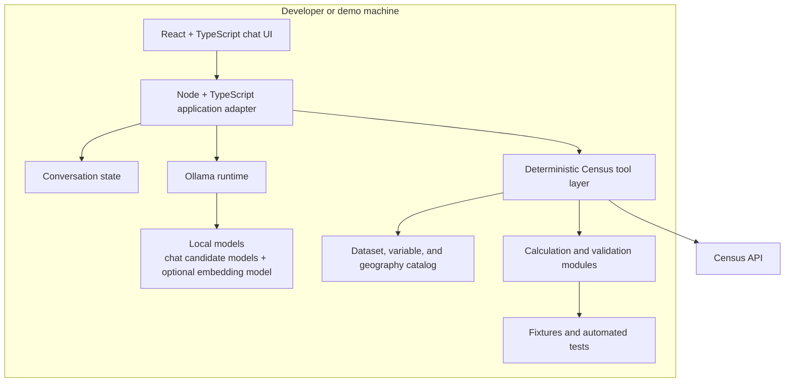
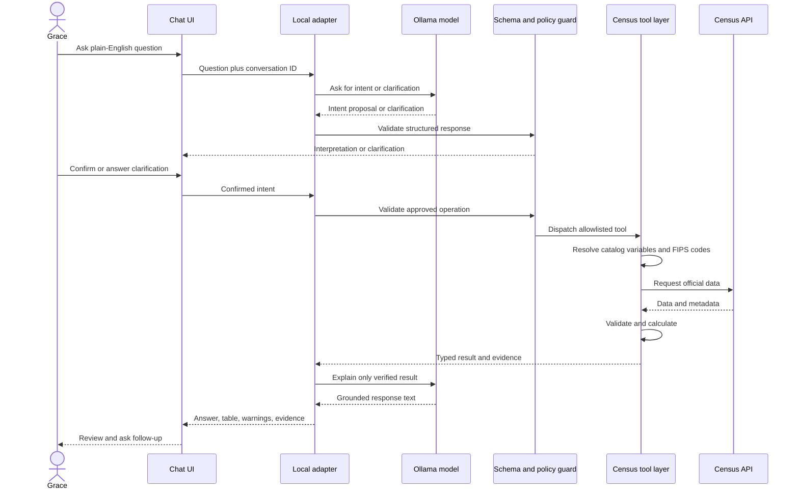

# CensusSense High-Level Architecture

**Status:** Implemented, MVP plus extensions  
**Audience:** Hackathon team  
**Scope:** MVP for four Census judging questions, since extended with a state-level poverty comparison and a combined Census/CDC health-outcome metric  
**Last updated:** 2026-09-11

## 1. Purpose

CensusSense is a conversational research assistant for Grace, a regional economic development officer. Grace asks questions in ordinary language and receives an answer she can defend: a concise explanation, exact values, calculation details, warnings, and a direct Census source URL.

The architecture deliberately separates probabilistic language work from authoritative data work:

- The local Ollama model interprets questions, asks clarifications, selects approved tools, and explains verified results.
- Application code controls datasets, variables, geographies, API requests, calculations, validation, and evidence.

## 2. MVP Goals

The first release must support:

1. Virginia county population growth comparisons.
2. Work-from-home percentage changes.
3. Median household income comparisons across named counties.
4. Communities with aging populations and relatively low household income.

Every successful response must preserve the original question, interpreted intent, dataset, vintage, variables, geography filters, raw values, calculation, warnings, and source URL.

### Implemented extensions beyond the MVP goals

5. State-level poverty rate comparisons across two or more named states.
6. County-level low-income and high-diabetes-prevalence screening, joining an ACS income variable with a CDC PLACES chronic-disease measure by county FIPS code.
7. A catalog-review flow (`/api/catalog/search` and `/api/catalog/approve`) that lets a reviewer promote a discovered ACS variable into a runtime-registered direct metric without a code change.

These extensions follow the same guardrails as the original four goals: the model proposes an intent, application code resolves geography, selects catalog-approved variables, performs the calculation, and builds evidence.

## 3. System Context

The browser communicates with the local adapter over HTTP. The adapter communicates with Ollama and owns the tool loop. The Census API and the CDC PLACES API remain the authoritative external data sources; PLACES is queried only for the combined income/health metric and requires no API key.

## 4. Container Architecture

### Components

**Chat UI**

Provides the transcript, composer, example prompts, interpretation preview, clarification messages, tool activity, answer summary, result tables, evidence panel, and error states.

**Local application adapter**

Provides the browser API, conversation state, Ollama client, structured-output validation, tool dispatch, timeouts, and fallback behavior. This is the policy boundary for the system.

**Ollama runtime**

Runs the locally available models. Candidate chat models are `gpt-oss:20b`, `gemma4:31b`, and `mistral-nemo:latest`. Select the default through a small benchmark covering intent accuracy, tool compliance, grounding, and latency. `nomic-embed-text-v2-moe:latest` is optional and should not force a vector database into the MVP. The active model is held in server memory and can be switched at runtime from the chat UI's model picker or `POST /api/ollama/model`, without editing `.env` or restarting the server, which makes the benchmark easy to run interactively.

**Deterministic Census and PLACES tools**

Expose narrow operations such as resolving geographies, querying an approved metric, calculating a comparison, and building evidence. Tool inputs are schema-validated and use catalog keys rather than arbitrary Census variable IDs, PLACES measure IDs, or URLs.

**Census catalog and calculation modules**

Maintain approved datasets, vintages, variables, labels, universes, units, geography mappings, formulas, and warnings in reviewable code or configuration. Calculations run outside the model and are covered by unit tests.

## 5. Runtime Request Flow

## 6. Key Decisions

| Decision | Rationale | Trade-off |
|---|---|---|
| Chat-first UI | Matches Grace's natural-language workflow and makes AI use visible to judges | Requires conversation state and clarification handling |
| Local Ollama adapter | Uses the team’s existing models without external model credentials | Local model quality and latency must be benchmarked |
| Deterministic Census tools | Prevents hallucinated variables, numbers, formulas, and citations | Supported question types must be explicitly cataloged |
| Direct Census API | Keeps provenance and source URLs clear | Live API failures need useful error handling |
| Fixture-based tests | Makes correctness reproducible without network dependency | Fixtures require maintenance when supported datasets change |
| No vector database initially | The MVP uses a small approved catalog, not open-ended document retrieval | Broad discovery questions are out of scope |

## 7. Failure Boundaries

- **Ambiguous request:** ask a clarification; do not guess.
- **Unsupported metric:** explain the supported question types.
- **Invalid model output:** retry once with a constrained schema, then use the deterministic fallback or return an error.
- **Census API failure:** show a service error and preserve the attempted intent; never invent an answer.
- **Missing or suppressed values:** mark the affected result and calculation warning.
- **Incompatible comparison:** block the comparison when dataset, universe, unit, or vintage do not match.

## 8. Delivery Shape

Four team members can work in parallel after agreeing on shared types and fixtures:

1. Census data and calculation tools.
2. Ollama adapter, intent schema, and guardrails.
3. Chat UI and evidence presentation.
4. Fixtures, judging-question verification, and demo documentation.

The first integration target is the five-county median-income question because it proves the complete chat, tool, calculation, and evidence path with the smallest calculation surface.

## 9. Out of Scope for MVP

Do not add MCP, LangGraph, CrewAI, Kubernetes, authentication, a vector database, multi-agent orchestration, arbitrary Census question answering, or server-side model hosting unless a measured requirement makes one necessary.