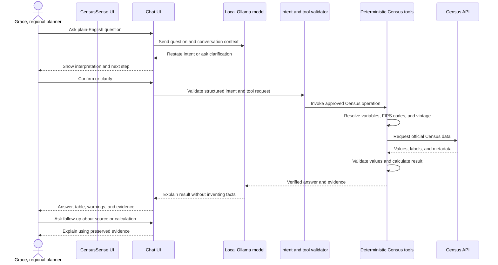
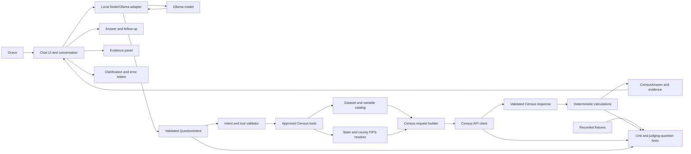

# CensusSense: Teammate Brief

## Status update

All four judging questions below are implemented. The approved metric catalog has since been extended with two additional metrics that follow the same guardrails: a state-level poverty-rate comparison, and a county-level "low income and high diabetes prevalence" metric that joins ACS median household income with CDC PLACES chronic-disease data by county FIPS code. The chat UI also has a model picker (top bar) that lists locally pulled Ollama models and switches the active one at runtime with no restart, useful for the model benchmark described below. See [detailed-specification.md](detailed-specification.md) for the current metric catalog and contracts.

## Mission

Build a working tool for Grace, a regional economic development officer, who asks plain-English questions about Census data and needs answers she can defend in a meeting. The app must return a clear answer plus enough evidence to reproduce it from the official Census API.

## What We Must Demonstrate

The MVP must answer these four judging questions:

1. Which counties in Virginia have experienced the largest population growth?
2. Where has the percentage of people working from home changed the most?
3. How does median household income compare across five named counties?
4. Which communities have both an aging population and relatively low household income?

The judging story has three parts:

- **Use of AI:** AI accelerates natural-language interpretation, explanation, coding, and test generation.
- **AI guardrails:** AI cannot invent Census variables, FIPS codes, datasets, calculations, rankings, or evidence.
- **Tool use:** Grace sees the interpreted question, result, source values, formula, Census URL, and caveats.

## Product Flow: Chat First

The product is a conversational research assistant, not a form that hides the reasoning flow. Grace types a question, the local Ollama model restates its interpretation, and the assistant asks a concise clarification when geography, time period, metric, or comparison is ambiguous. After confirmation, the model calls approved Census tools. The tools retrieve and calculate the answer deterministically, then the assistant explains the verified result in the same conversation. Grace can follow up with questions such as “show the calculation” or “which counties did you compare?”

The UI should visibly show human-readable activity such as “Checking ACS county data” and “Calculating population growth,” followed by the answer, exact values, warnings, and an expandable evidence panel.



## Architecture

Keep the first version small: a TypeScript chat UI, a small local Node/Ollama adapter, a narrow Census tool layer, a maintained variable catalog, deterministic calculations, and fixture-based tests. The browser talks to the adapter; the adapter talks to Ollama and the Census tools. The local model inventory is `gpt-oss:20b`, `gemma4:31b`, `mistral-nemo:latest`, and `nomic-embed-text-v2-moe:latest`. Benchmark the three chat candidates locally; use the embedding model only if retrieval proves necessary.



## Parallel Workstreams

### 1. Data layer

Own `src/census/`: API client, ACS dataset and variable catalog, FIPS resolution, response validation, calculations, and deterministic fixtures. Return typed answers with request URLs, raw values, formulas, and timestamps.

### 2. Conversation, interpretation, and guardrails

Own `src/interpretation/` and the local Node/Ollama adapter: maintain conversation state, parse questions into `QuestionIntent`, ask clarifying questions, reject unsupported questions, and constrain model output to approved tool schemas. Benchmark `gpt-oss:20b`, `gemma4:31b`, and `mistral-nemo:latest` for structured intent and tool compliance. Never let the model choose arbitrary variables or calculate authoritative numbers.

### 3. Chat frontend and evidence

Own `src/components/` and `src/styles.css`: chat transcript, composer, example prompts, interpretation and clarification bubbles, tool-activity status, answer summary, comparison table, evidence panel, responsive layout, and keyboard accessibility.

### 4. Verification and demo

Own `src/test/` and `docs/`: fixtures and tests for all four judging questions, manual demo script, AI-use explanation, guardrail explanation, and final integration checks. This member also coordinates contract mismatches between workstreams.

## Shared Contracts Before Parallel Work

Agree on these types before implementation begins:

```ts
type QuestionIntent = {
  metric: "population" | "work_from_home" | "median_household_income" | "aging_and_income";
  geography: "county" | "state";
  state?: string;
  counties?: string[];
  years: string[];
  operation: "compare" | "growth" | "change" | "filter";
};

type CensusAnswer = {
  summary: string;
  rows: Array<Record<string, string | number | null>>;
  evidence: {
    dataset: string;
    vintage: string;
    variables: Array<{ id: string; label: string }>;
    geography: string;
    filters: Record<string, string>;
    requestUrl: string;
    rawValues: Array<Record<string, unknown>>;
    calculation: string;
    retrievedAt: string;
  };
  warnings: string[];
};
```

## Integration Order and Definition of Done

1. Lock the contracts and supported metric names.
2. Build the chat shell and Ollama adapter with a deterministic fallback parser.
3. Build the five-county median-income tool flow with fixtures.
4. Connect the live Census request and evidence panel.
5. Add the other three judging questions and rehearse follow-ups, unsupported input, and API failure.

The MVP is ready when every judging question produces a defensible answer, the displayed numbers agree with raw fixture/API values, the source URL is visible, and the team can explain exactly where AI stops and deterministic logic begins.

## Risks to Watch

- Do not compare incompatible ACS products, universes, units, or vintages.
- Treat missing, suppressed, and margin-of-error values explicitly.
- Do not allow API failures to become confident prose.
- Keep calculations in tested application code, not in prompts.
- Keep scope narrow until the four judging questions work end to end.